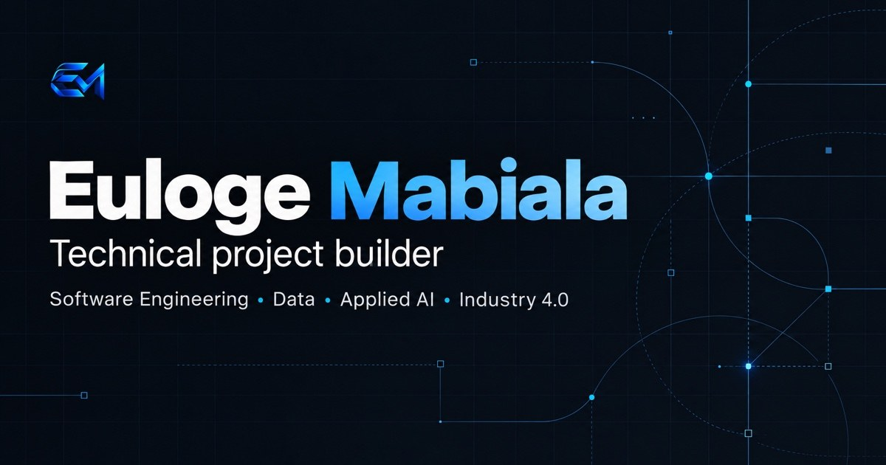

# Euloge Mabiala — Engineering Portfolio

<p align="center">
  
</p>

<p align="center">
  <a href="https://eulogep-portfolio.eulogep-portfolio.workers.dev"><strong>View the live portfolio</strong></a>
  ·
  <a href="https://github.com/eulogep">GitHub profile</a>
</p>

<p align="center">
  
  
  
  
</p>

An evidence-backed portfolio presenting software engineering, data, applied AI and Industry 4.0 work. It combines immersive project navigation with explicit authorship, validation and limitation boundaries.

## Highlights

- Twelve public projects organised as seven featured and five secondary projects.
- Reusable 3D glassmorphism carousel on the home and projects pages.
- French and English interface with persistent language selection.
- Narrative journey from scientific foundations to current Industry 4.0 work.
- Real project screenshots, architecture diagrams and observed execution evidence.
- Responsive layouts validated from 320 px to 1440 px.
- Keyboard navigation, reduced-motion support and accessible semantic structure.
- Static deployment with a strict Content Security Policy and no application backend.

## Featured engineering work

| Project | Focus | Main technologies |
|---|---|---|
| Engineer Learning OS | Evidence-oriented learning system and document extraction | Next.js, React, TypeScript |
| Professional Hub | Authenticated document workflows and owner isolation | Next.js, Supabase, PostgreSQL |
| Corrector AI | OCR and validated multi-provider AI output | Python, FastAPI, structured AI |
| Mentor Evolution | Persistent spaced-repetition scheduling | Python, Flask, Py-FSRS |
| Classeur Numérique Intelligent | Local-first document organisation and recovery | React, IndexedDB, Playwright |
| ECV | Encrypted code-vault workflow and CLI | TypeScript, Shell, Swift |
| Manga Wave | Catalogue, reading and resilient source abstraction | Next.js, React, Supabase |

Every project page distinguishes observed capabilities from limitations. Repository presence or test files are never presented as proof of production readiness.

## Architecture

```text
Reviewed private identity sources
              │
              ▼
Privacy-filtered compiler
              │
              ▼
src/data/generated/public-portfolio.json
              │
              ▼
Astro pages and reusable components
              │
              ▼
Static dist/ artifact → Cloudflare Workers
```

The public application reads only the generated public projection. Private identity sources, historical CV files, raw GitHub exports and internal evidence registries are not part of the public repository or deployed artifact.

## Technology

- Astro 7 with static output
- TypeScript 6 and Zod validation
- Tailwind CSS 4 through the Vite integration
- Framework-free client modules for the carousel and language switcher
- Vitest, ESLint and Astro Check
- Cloudflare Workers Static Assets

No database, authentication layer, analytics service or server runtime is required by the portfolio.

## Run locally

Requirements: Node.js 24 LTS and npm 11 or later.

```bash
npm ci
npm run typecheck
npm run lint
npm test
npm run build
npm run dev
```

The development server will print its local URL. The production-ready static artifact is written to `dist/`.

## Quality gates

```bash
npm run typecheck      # Astro and TypeScript diagnostics
npm run lint           # source and import-boundary linting
npm test               # unit, schema and public-boundary tests
npm run test:privacy   # focused public-output privacy checks
npm run build          # static build plus final artifact verification
```

The build verifies required routes, internal links, unique titles, media assets, project counts, security boundaries and the absence of private identity files in `dist/`.

## Repository boundary

This public repository contains the portfolio implementation and its already reviewed public data projection. The canonical professional-identity model and its raw evidence stay private by design. Regenerating the projection requires the private source workspace; building and reviewing the published portfolio does not.

## Deployment

The current public version is available at:

**https://eulogep-portfolio.eulogep-portfolio.workers.dev**

The site is served as static assets through Cloudflare Workers. A custom canonical domain and search-engine indexing remain intentionally deferred.

## Author

**Euloge Mabiala** — [github.com/eulogep](https://github.com/eulogep)
